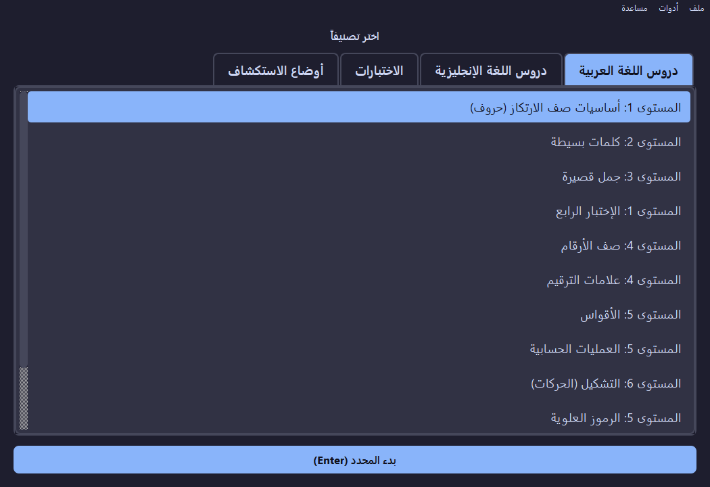
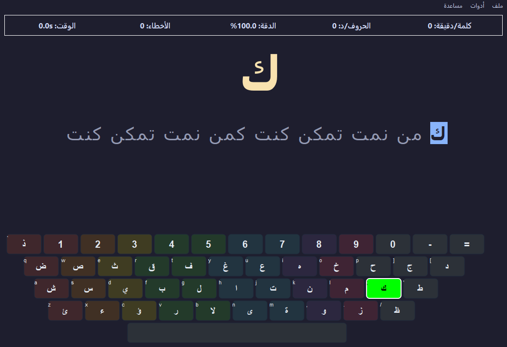
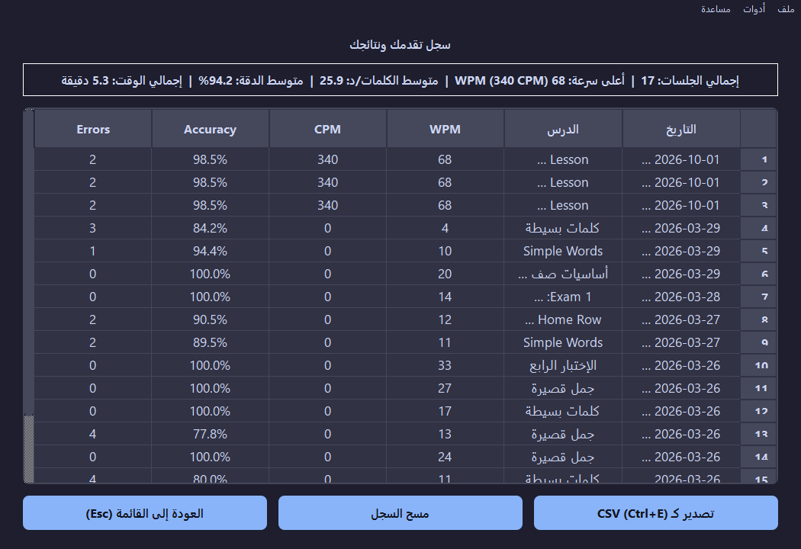
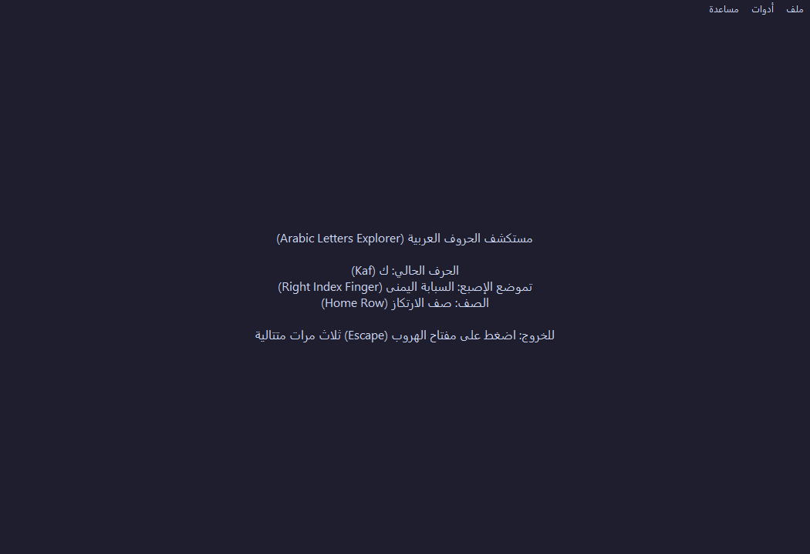

# ⌨️ TypingTrainer (Accessible Typing Tutor) - مدرب الطباعة الميسر


**TypingTrainer** هو برنامج تدريب طباعة تفاعلي وشامل ومفتوح المصدر، مصمم خصيصاً لتمكين الجميع من إتقان الطباعة السريعة باللمس (Touch Typing) باللغتين العربية والإنجليزية. يضع البرنامج إمكانية الوصول الشاملة (**100% Accessibility**) في صلب تصميمه لضمان تجربة تعليمية متميزة للمكفوفين وضعاف البصر عبر التكامل الكامل مع قارئات الشاشة والتعليق الصوتي الدقيق.

---

## ✨ المميزات الرئيسية (Key Features)

* 🎯 **محرك طباعة متقدم (Advanced Typing Engine):**
  * يدعم 3 أوضاع تدريبية: وضع الحروف، وضع الكلمات، ووضع الجمل الكاملة.
  * حساب دقيق وفوري لمعدل سرعة الطباعة الصافية (**Net WPM**) ونسبة الدقة (**Accuracy**).
* ♿ **إمكانية الوصول الشاملة (100% Accessible):**
  * دعم مدمج وعميق لقارئات الشاشة بدون الحاجة لإعدادات إضافية:
    * **Windows:** دعم مباشر عبر `UniversalSpeech` (NVDA, JAWS, SAPI).
    * **macOS:** دعم مباشر لـ `VoiceOver` عبر `AppleScript`.
    * **Linux:** دعم مباشر لـ `Speech-Dispatcher` و `Orca`.
* 🧠 **محرك نطق ذكي وطابور صوتي (Smart TTS Verbalizer & Queue):**
  * نطق صوتي دقيق لجميع علامات الترقيم، الرموز الحسابية، والأقواس.
  * نطق الحركات والتشكيل في اللغة العربية بدقة لمنع الالتباس.
  * نظام طابور صوتي متقدم يمنع تداخل الأصوات عند الكتابة السريعة.
* 🔍 **أوضاع الاستكشاف الآمنة (Keyboard Explorer Modes):**
  * استكشاف مفاتيح لوحة المفاتيح والتعرف على تموضع الأصابع ومفاتيح التعديل والنظام (Shift, Ctrl, Alt).
  * **نظام خروج آمن:** يتطلب الضغط 3 مرات متتالية على مفتاح `Escape` لمنع الخروج غير المقصود أثناء الاستكشاف.
* ✋ **توجيهات صوتية لتموضع الأصابع (Guided Finger Prompts):**
  * توجيهات صوتية فورية توضح الإصبع المناسب لكل حرف (الخنصر، البنصر، الوسطى، السبابة، الإبهام) على لوحتي المفاتيح العربية والإنجليزية.
* 📝 **محرر دروس ذكي مع مزامنة المحتوى (Lesson Editor & Smart Merge):**
  * إنشاء وتعديل وحذف الدروس المخصصة بسهولة.
  * مزامنة الدروس الافتراضية مع التحديثات دون المساس بالدروس التي أنشأها المستخدم.
* 🔄 **نظام تحديث تلقائي ذكي (Smart Auto-Updater):**
  * فحص دوري في الخلفية لتحديثات البرنامج عبر GitHub Releases.
  * تحميل وتثبيت التحديثات بصمت تام وسلاسة للنسخ المثبتة والمحمولة مع التحقق من تجزئة `SHA-256`.
* 🎨 **واجهة بصرية متوافقة ومريحة:**
  * دعم الوضع الليلي (Dark Theme) ووضع التباين العالي (High Contrast).
  * مؤثرات صوتية تفاعلية للطباعة الصحيحة والأخطاء واكتمال الدروس عبر `PySide6.QtMultimedia`.

---

## 📸 لقطات من واجهة البرنامج (Screenshots - Dark Theme)

<div align="center">

| الشاشة الرئيسية وقائمة الدروس | شاشة التدريب والتوجيه الصوتي |
| :---: | :---: |
|  |  |

| شاشة النتائج والإحصائيات | مستكشف لوحة المفاتيح |
| :---: | :---: |
|  |  |

</div>

---

## 📥 التحميل والتثبيت (Downloads)

البرنامج متاح للتحميل مجاناً لكافة أنظمة التشغيل (نسخ تثبيت قياسية ونسخ محمولة لا تتطلب تثبيتاً).
يمكنك تحميل أحدث إصدار دائماً من صفحة **[الإصدارات (Releases)](https://github.com/MesterPerfect/typing_trainer/releases)**.

* **Windows:**
  * 📦 `TypingTrainer_Setup_vX.X.X.exe` (ملف التثبيت التلقائي مع اختصارات سطح المكتب)
  * 💼 `TypingTrainer_Windows_Portable_vX.X.X.zip` (نسخة محمولة تعمل مباشرة)
* **macOS:**
  * 💿 `TypingTrainer_macOS_Installer_vX.X.X.dmg` (حزمة تثبيت بنظام السحب والإفلات)
  * 💼 `TypingTrainer_macOS_Portable_vX.X.X.zip` (نسخة محمولة)
* **Linux:**
  * 📦 `TypingTrainer_Linux_Installer_vX.X.X.deb` (حزمة Debian/Ubuntu مع اختصار قائمة التطبيقات)
  * 💼 `TypingTrainer_Linux_Portable_vX.X.X.tar.gz` (نسخة محمولة)

---

## ⌨️ اختصارات لوحة المفاتيح (Keyboard Shortcuts)

| المفتاح | الوظيفة |
| :--- | :--- |
| `Enter` / `Return` | بدء الدرس المحدد |
| `Escape` | العودة للخلف / الخروج من وضع الاستكشاف (بالضغط 3 مرات متتالية) |
| `F2` | تفعيل / تعطيل التوجيهات الصوتية لتموضع الأصابع |
| `F3` | فتح نافذة الإعدادات |
| `F4` | عرض سجل النتائج والإحصائيات |
| `F5` – `F8` | أوضاع الاستكشاف (حر، الحروف العربية، الحروف الإنجليزية، الأرقام) |
| `F9` | مستكشف مفاتيح النظام / محرر الدروس |
| `Ctrl + N` | إنشاء درس جديد في محرر الدروس |
| `Ctrl + S` | حفظ الدرس في محرر الدروس |

---

## 🛠️ للمطورين (For Developers)

تم بناء المشروع بالكامل بلغة **Python** وإطار عمل **PySide6**.

### إعداد بيئة التطوير (Setup Environment)

1. استنسخ المستودع:
   ```bash
   git clone https://github.com/MesterPerfect/typing_trainer.git
   cd typing_trainer
   ```

2. أنشئ البيئة الافتراضية وفعّلها:
   ```bash
   python -m venv venv
   # Windows:
   venv\Scripts\activate
   # macOS / Linux:
   source venv/bin/activate
   ```

3. ثبّت الحزم والمكتبات المطلوبة:
   ```bash
   pip install -r requirements.txt
   ```

4. شغّل البرنامج:
   ```bash
   python main.py
   ```

### 🏗️ الهيكل المعماري للمشروع (Architecture)

يتبع المشروع معمارية الخدمات المنفصلة والطبقات النظيفة (**Clean Architecture**):
* `core/`: محرك الطباعة (`TypingEngine`)، محرك الاستكشاف، الإحصائيات، وثوابت البرنامج.
* `models/`: نماذج البيانات والدروس وحفظ النتائج المبنية على `@dataclass`.
* `services/`: طبقة الخدمات المستقلة (نظام التحديثات `updater`، تحويل النص لكلام `tts`، المؤثرات الصوتية `audio`، إدارة الإعدادات `settings`، وتحليلات الاستخدام).
* `ui/`: واجهات المستخدم الرسومية (`PySide6`)، إدارة النوافذ المشتركة (`QStackedWidget`)، وتنسيقات الـ QSS.
* `utils/`: أدوات مساعدة ونظام التوثيق المتناوب (`RotatingFileHandler`).
* `apply_update.py`: أداة مستقلة لتنفيذ التحديث الذاتي والكتابة الآمنة فوق الملفات أثناء التحديث التلقائي.

---

## ⚙️ البناء والنشر المؤتمت (CI/CD Pipeline)

يحتوي المستودع على خط أنابيب **GitHub Actions** متكامل يقوم عند رفع تحديث أو وسم جديد ببناء وتجهيز 6 حزم تنفيذية لجميع الأنظمة عبر **cx_Freeze** و **Inno Setup**، واحتساب قيم تجزئة **SHA-256**، وتحديث ملف `update.json` ونشر الإصدار تلقائياً.

---

## 🤝 المساهمة (Contributing)

نرحب بجميع المساهمات والأفكار لتطوير البرنامج!
1. قم بعمل Fork للمشروع.
2. أنشئ فرعاً لميزتك (`git checkout -b feature/AmazingFeature`).
3. سجّل التعديلات (`git commit -m 'Add some AmazingFeature'`).
4. ارفع الفرع (`git push origin feature/AmazingFeature`).
5. افتح Pull Request.

---

## 📄 حقوق النشر والترخيص (License)

هذا المشروع مفتوح المصدر ومرخص تحت رخصة **GPLv3**.
جميع الحقوق محفوظة © 2026 لـ [MesterPerfect](https://github.com/MesterPerfect).
نسأل الله أن ينفع بهذا العمل ويكون عوناً لكل من يسعى لتطوير مهاراته في الطباعة.
