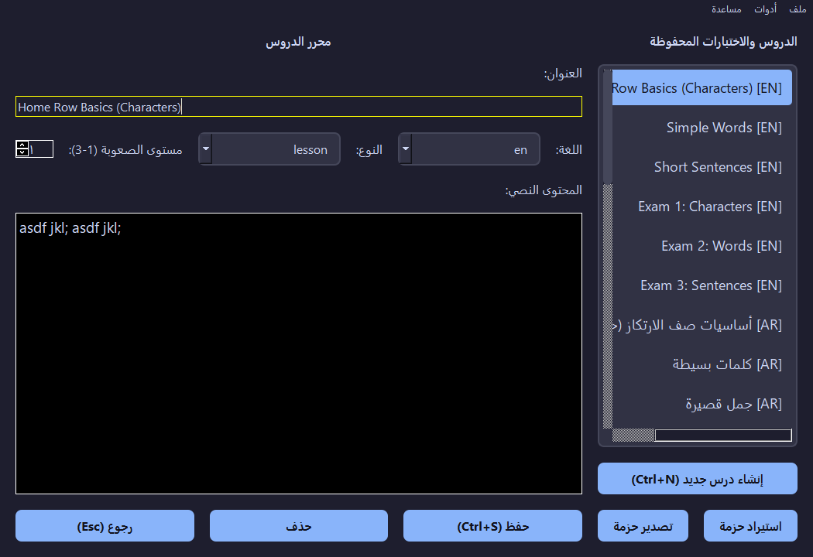
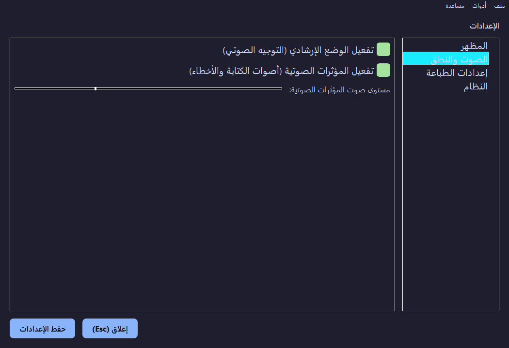
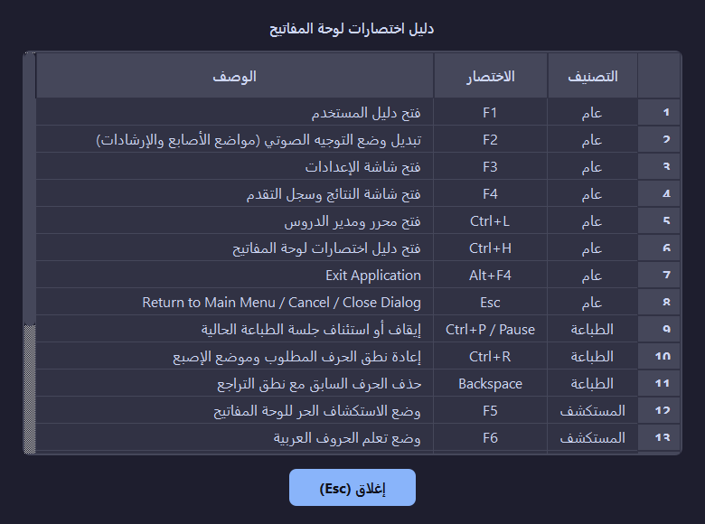

# ⌨️ TypingTrainer (Accessible Typing Tutor) - مدرب الطباعة الميسر

<div align="center">


</div>

---

**TypingTrainer** هو برنامج تفاعلي ومفتوح المصدر لتعليم وتدريب الطباعة السريعة باللمس (**Touch Typing**) باللغتين العربية والإنجليزية. صُمم البرنامج من الأساس ليضع معايير إمكانية الوصول الشاملة (**100% Accessibility**) في المقام الأول، مما يتيح تجربة تعليمية سلسة وممتعة للمكفوفين وضعاف البصر والمستخدمين كافة عبر التوافق التام مع قارئات الشاشة والتعليق الصوتي الفوري.

---

## ✨ المميزات الرئيسية (Key Features)

* 🎯 **محرك تدريب متطور (Advanced Typing Engine):**
  * يدعم 3 أنماط تدريبية متدرجة: نمط الحروف الفردية، نمط الكلمات، ونمط الجمل والنصوص الكاملة.
  * قياس فوري ودقيق لسرعة الطباعة الصافية (**Net WPM**) وعدد الحروف في الدقيقة (**CPM**) ونسبة الدقة (**Accuracy**).
* ♿ **إمكانية وصول كاملة (100% Screen Reader Accessible):**
  * تكامل مدمج وعميق مع محركات قراءة الشاشة في مختلف البيئات:
    * **Windows:** عبر `UniversalSpeech` لدعم برامج NVDA و JAWS ومحركات SAPI.
    * **macOS:** دعم مباشر لـ `VoiceOver` عبر `AppleScript`.
    * **Linux:** دعم كامل لـ `Speech-Dispatcher` و `Orca`.
* 🧠 **محرك نطق ذكي وطابور صوتي (Smart TTS Verbalizer & Queue):**
  * نطق لفظي دقيق لعلامات الترقيم، الرموز الحسابية، والأقواس بدون تشويش.
  * قراءة الحركات والتشكيل في اللغة العربية بدقة لمنع أي التباس في الكلمات المشكولة.
  * نظام طابور صوتي متقدم يمنع تداخل الأصوات (Debounced Audio Queue) أثناء الكتابة السريعة.
* 🔍 **أوضاع استكشاف لوحة المفاتيح (Safe Explorer Modes):**
  * استكشاف أزرار لوحة المفاتيح والتعرف على تموضع الأصابع ومفاتيح التعديل والنظام (Shift, Ctrl, Alt).
  * **نظام الخروج الآمن:** يتطلب الضغط 3 مرات متتالية على مفتاح `Escape` لمنع الخروج غير المقصود.
* ✋ **توجيهات صوتية حية لمواضع الأصابع (Guided Finger Prompts):**
  * إرشادات صوتية توضح الإصبع المخصص لكل مفتاح (الخنصر، البنصر، الوسطى، السبابة، الإبهام) على لوحتي المفاتيح العربية والإنجليزية.
* 📝 **محرر دروس متكامل ومزامنة ذكية (Lesson Editor & Smart Merge):**
  * إنشاء وتعديل وحفظ الدروس والاختبارات المخصصة، مع إمكانية تصدير واستيراد الحزم.
  * مزامنة الدروس الرسمية الجديدة دون المساس بدروس المستخدم المخصصة.
* 🔄 **نظام تحديث تلقائي صامت (Smart Auto-Updater):**
  * فحص دوري في الخلفية لأحدث الإصدارات عبر GitHub Releases مع التحقق من تجزئة `SHA-256`.
  * تحديث سلس وتلقائي يدعم كلاً من النسخ المثبتة والنسخ المحمولة (Portable).
* 🎨 **واجهة رسومية ومؤثرات صوتية متقدمة:**
  * دعم الوضع الليلي (Dark Theme) ووضع التباين العالي (High Contrast).
  * مؤثرات صوتية تفاعلية للطباعة الصحيحة، الأخطاء، واكتمال الدروس عبر `PySide6.QtMultimedia`.

---

## 📸 لقطات من واجهة البرنامج (Screenshots - Dark Theme)

<div align="center">

| القائمة الرئيسية واختيار الدروس | جلسة التدريب والتوجيه الصوتي |
| :---: | :---: |
|  |  |

| سجل التقدم والنتائج | مستكشف لوحة المفاتيح والتموضع |
| :---: | :---: |
|  |  |

| محرر الدروس وإدارة الحزم | نافذة الإعدادات والتخصيص |
| :---: | :---: |
|  |  |

| دليل اختصارات لوحة المفاتيح التفاعلي |
| :---: |
|  |

</div>

---

## 📥 التحميل والتثبيت (Downloads)

البرنامج متاح للتحميل مجاناً لكافة منصات التشغيل (نسخ تثبيت قياسية ونسخ محمولة جاهزة للتشغيل المباشر).
يمكنك تحميل أحدث إصدار دائماً من صفحة **[الإصدارات (Releases)](https://github.com/MesterPerfect/typing_trainer/releases)**.

| نظام التشغيل | نسخة التثبيت (Installer) | النسخة المحمولة (Portable) |
| :--- | :--- | :--- |
| **🪟 Windows** | [`TypingTrainer_Setup.exe`](https://github.com/MesterPerfect/typing_trainer/releases) | [`TypingTrainer_Windows_Portable.zip`](https://github.com/MesterPerfect/typing_trainer/releases) |
| **🍎 macOS** | [`TypingTrainer_macOS_Installer.dmg`](https://github.com/MesterPerfect/typing_trainer/releases) | [`TypingTrainer_macOS_Portable.zip`](https://github.com/MesterPerfect/typing_trainer/releases) |
| **🐧 Linux** | [`TypingTrainer_Linux_Installer.deb`](https://github.com/MesterPerfect/typing_trainer/releases) | [`TypingTrainer_Linux_Portable.tar.gz`](https://github.com/MesterPerfect/typing_trainer/releases) |

---

## ⌨️ اختصارات لوحة المفاتيح (Keyboard Shortcuts)

| المفتاح | الوظيفة |
| :--- | :--- |
| `Enter` / `Return` | بدء الدرس أو النمط المحدد |
| `Escape` | الرجوع للقائمة السابقة / الخروج من وضع الاستكشاف (3 ضغطات) |
| `F1` | فتح دليل المستخدم والمساعدة |
| `F2` | تبديل وضع التوجيه الصوتي لمواضع الأصابع والإرشادات |
| `F3` | فتح شاشة الإعدادات |
| `F4` | فتح شاشة النتائج وسجل التقدم |
| `Ctrl + L` | فتح محرر ومدير الدروس |
| `Ctrl + H` | فتح دليل اختصارات لوحة المفاتيح التفاعلي |
| `F5` | وضع الاستكشاف الحر للوحة المفاتيح |
| `F6` | وضع استكشاف الحروف العربية |
| `F7` | وضع استكشاف الحروف الإنجليزية |
| `F8` | وضع استكشاف الأرقام |
| `F9` | وضع استكشاف مفاتيح النظام والتعديل |
| `Ctrl + P` / `Pause` | إيقاف مؤقت / استئناف جلسة الطباعة الحالية |
| `Ctrl + R` | إعادة نطق الحرف المطلوب وموضع الإصبع |
| `Ctrl + N` | إنشاء درس جديد في محرر الدروس |
| `Ctrl + S` | حفظ التعديلات في محرر الدروس |
| `Ctrl + E` | تصدير سجل النتائج إلى ملف CSV |

---

## 🛠️ للمطورين (For Developers)

تم بناء وتطوير المشروع باستخدام لغة **Python 3.11+** وإطار عمل **PySide6 (Qt6)**.

### إعداد بيئة التطوير (Setup Environment)

1. استنسخ مستودع المشروع:
   ```bash
   git clone https://github.com/MesterPerfect/typing_trainer.git
   cd typing_trainer
   ```

2. أنشئ البيئة الافتراضية وفعّلها:
   ```bash
   python -m venv venv
   # Windows:
   venv\Scripts\activate
   # macOS / Linux:
   source venv/bin/activate
   ```

3. ثبّت الحزم والاعتماديات المطلوبة:
   ```bash
   pip install -r requirements.txt
   ```

4. شغّل البرنامج:
   ```bash
   python main.py
   ```

### 📸 التقاط لقطات الشاشة آلياً (Generate Screenshots)
يمكنك إعادة توليد كافة صور الواجهة التوثيقية تلقائياً بتشغيل السكربت المخصص:
```bash
python tests/capture_screenshots.py
```

### 🏗️ الهيكل المعماري للمشروع (Clean Architecture)

يتبع المشروع معمارية الخدمات المنفصلة والنظيفة لضمان سهولة الصيانة وقابلية التوسع:
* `core/`: المحركات الأساسية (`TypingEngine`, `ExplorerEngine`) وحساب الإحصائيات والثوابت.
* `models/`: هياكل ونماذج البيانات للدروس (`Lesson`) والنتائج (`LessonResult`) المعتمدة على `@dataclass`.
* `services/`: الخدمات المستقلة:
  * `updater/`: نظام التحقق وتنزيل التحديثات في الخلفية مع تجزئة SHA-256.
  * `tts/`: محركات تحويل النص إلى كلام متعددة المنصات مع معالجة النطق والتشكيل.
  * `audio.py`: مشغل المؤثرات الصوتية التفاعلية.
  * `settings_service.py` & `result_service.py`: إدارة الإعدادات وتخزين السجلات.
* `ui/`: الواجهات الرسومية المبنية بـ PySide6 وإدارة الشاشات عبر `QStackedWidget`.
* `utils/`: الأدوات المساعدة، التدويل والترجمة (`i18n`)، ونظام التوثيق المتناوب (`RotatingFileHandler`).
* `apply_update.py`: أداة التحديث الذاتي المستقلة والمؤمنة ضد هجمات مسارات الملفات.

---

## ⚙️ البناء والنشر المؤتمت (CI/CD Pipeline)

يحتوي المستودع على خط أنابيب **GitHub Actions** متكامل يقوم عند دفع التحديثات بـ:
1. بناء الحزم التنفيذية لجميع الأنظمة عبر **cx_Freeze** ومترجم **Inno Setup**.
2. توليد المثبتات والنسخ المحمولة لأنظمة Windows و macOS و Linux.
3. حساب تجزئات `SHA-256` وتحديث ملف `update.json` تلقائياً.
4. نشر الإصدار مباشرة على صفحة **GitHub Releases** ونشره على **WinGet**.

---

## 🤝 المساهمة (Contributing)

نرحب بجميع المساهمات والاقتراحات لتطوير البرنامج وإثراء محتواه!
1. قم بعمل **Fork** للمستودع.
2. أنشئ فرعاً جديداً لميزتك (`git checkout -b feature/AmazingFeature`).
3. سجّل تعديلاتك في Commit منظم (`git commit -m 'feat: Add some AmazingFeature'`).
4. ادفع الفرع لمستودعك (`git push origin feature/AmazingFeature`).
5. افتح **Pull Request** لمراجعة التعديلات ودمجها.

---

## 📄 حقوق النشر والترخيص (License)

هذا المشروع حر ومفتوح المصدر وتحت رخصة **GPLv3**.  
جميع الحقوق محفوظة © 2026 لـ [MesterPerfect](https://github.com/MesterPerfect).  
نسأل الله العلي القدير أن ينفع بهذا العمل ويكون عوناً للجميع.
